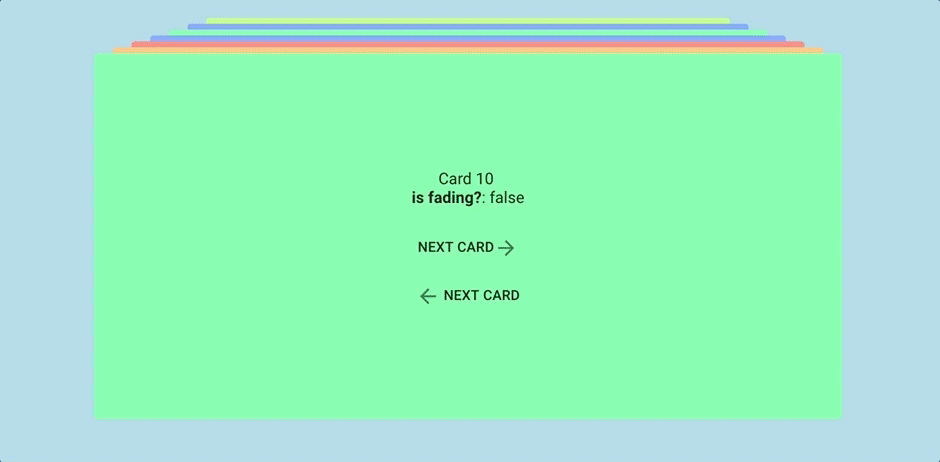

# ember-card-stacks

Beautiful card stacks for your ember application ([Demo](https://n1ru4l.github.io/ember-card-stacks/)).

## Installation

* `cd <your-ember-project-directory>`
* `ember install ember-card-stacks`
* `npm install animejs`

## Getting started

Check out the [demo](https://n1ru4l.github.io/ember-card-stacks/) hosted on github-pages for setting up your first card-stack within 5 minutes.

## Resources and Credits

* Thanks to [@crnacura](https://github.com/crnacura) from codrops which inspired me to create this plugin :)
* [Original Codrops article](https://tympanus.net/codrops/2015/10/28/effect-ideas-for-card-stacks/)
* [Demo repository of the Codrops article](https://github.com/codrops/CardStackEffects)

